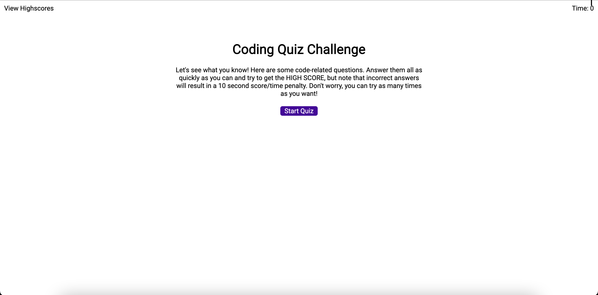
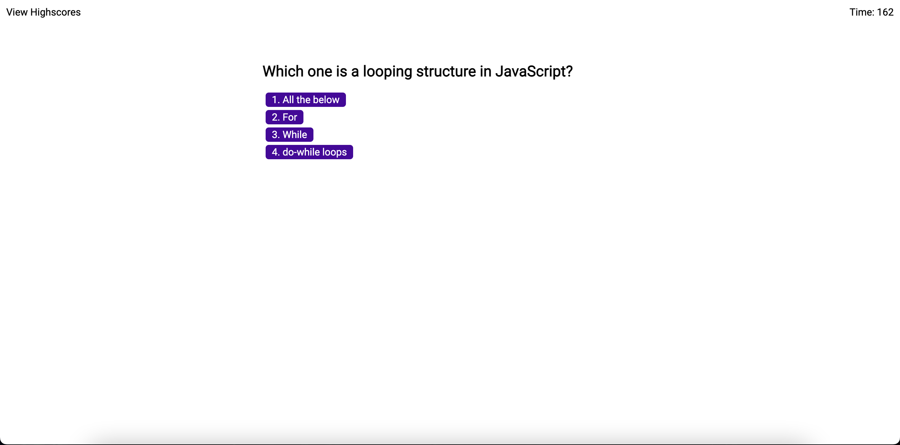
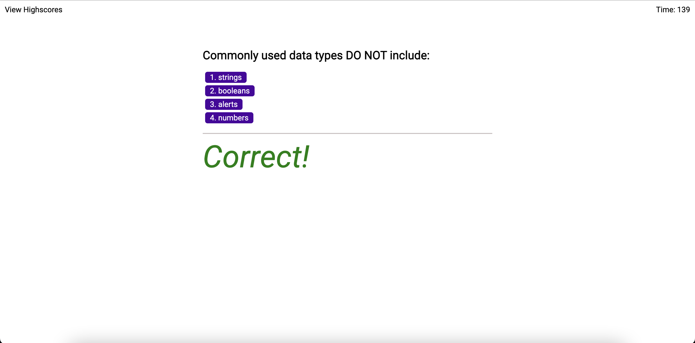
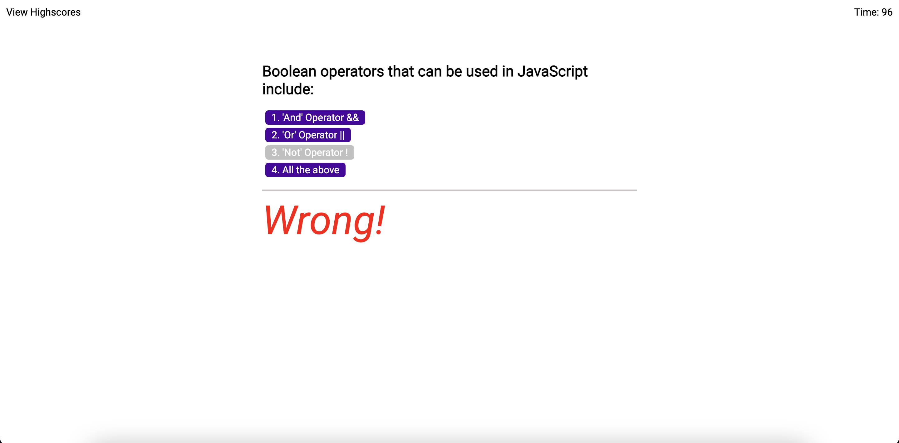
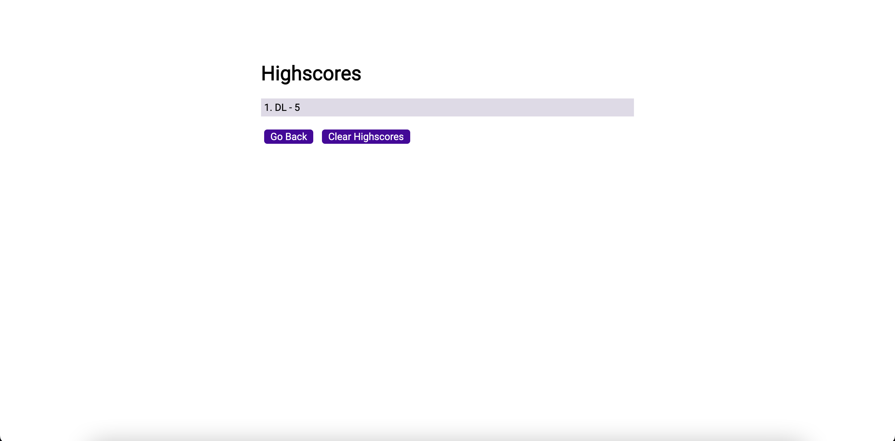

# Coding-Quiz
## Description
This is a simple coding quiz with multiple choice questions and a score tracker. The score tracker saves scores in the local storage after the user
inputs their intials and clicks done.

## Images

Thank you!